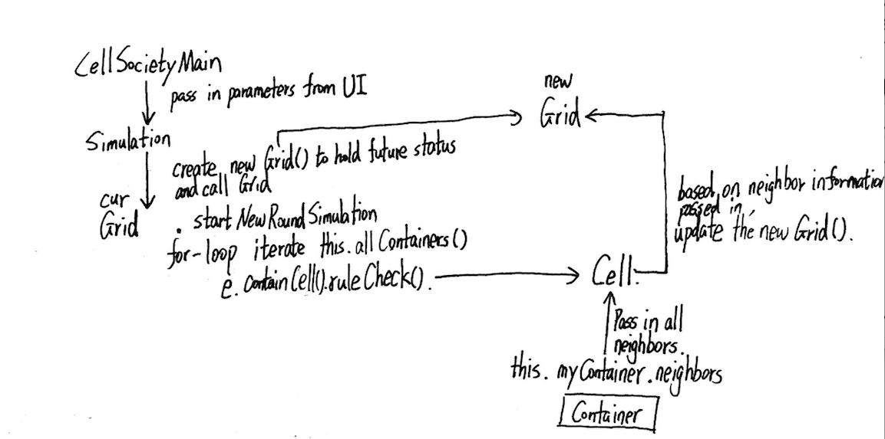
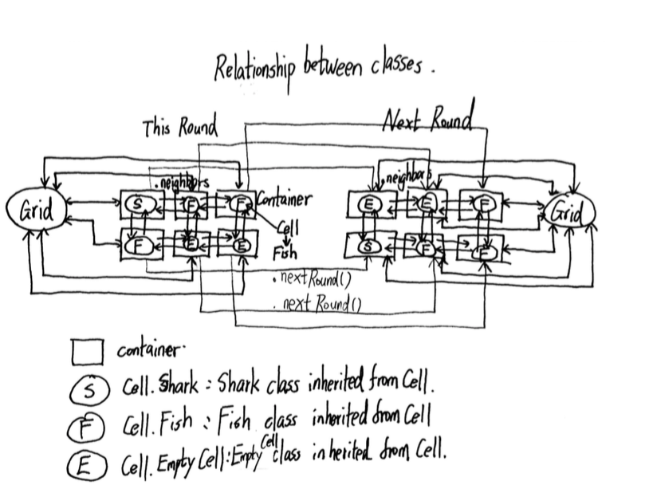
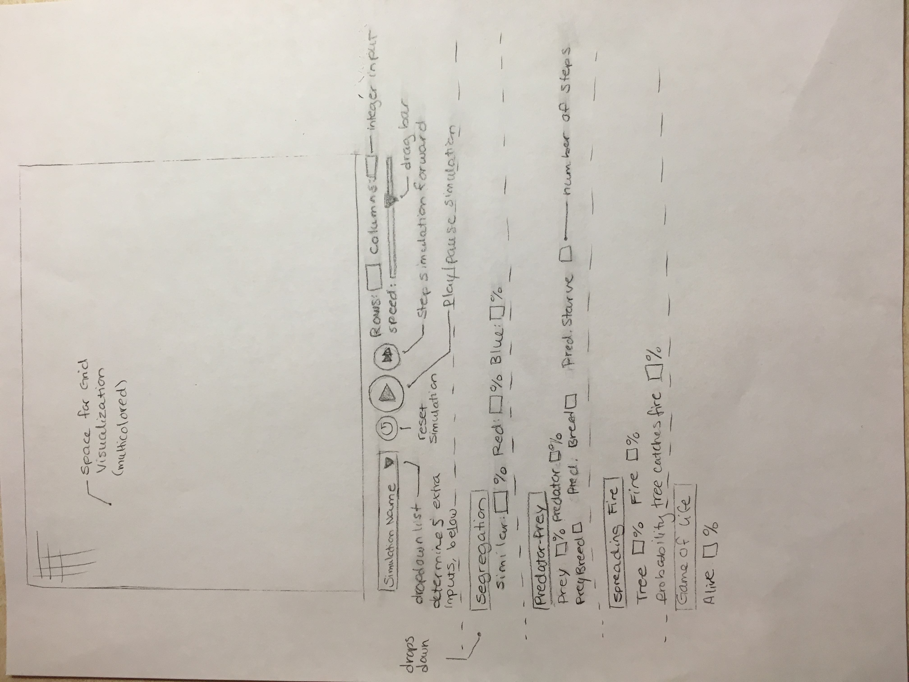

- Introduction
This program provides users the ability to perform a variety of Cellular Automata (CA) simulations including Conway’s Game of Life, Schelling's model of segregation, Wa-Tor World model of predator-prey relationships, Spreading of Fire and so on. The primary design goal is to create a flexible simulation tool that can handle different CA models without the need to make significant changes in our program. Extensions can be made to model new simulations and interactions without modifying how the game updates or the user interface. The subclasses are open and more can be added/extended from the abstract class, while the superclass, general backend, and user interface setup are closed.

- Overview
	
	
	The program includes these classes:
	- CellSocietyMain - Controls UI and display
	- Simulation - Coordinates the next following class and return the status of next round to UI display
	- Grid - Contains a list of Container. Iterates through each Container and updates the cell within.
	- Cell - Abstract Class
	- Fish, Shark, Tree, etc. Inherit Cell. They are added specifically according to each simulation.

	Running Procedure:
	
	1. In the program, we have a main class, which controls all the scene control and User Interface. This main class passes parameters to the Simulation class and call Simulation class each time UI needs to update.
	2. Simulation Class create a new Grid to hold the status of next round, connect the current Grid to the new Grid and connect each container of the current Grid to each container of the next Grid. Then call Grid.startNewRoundSimulation()
	3. Grid Class will iterate through each Container which belongs to the Grid in the high-to-low priority order. Call Container.containCell().ruleCheck() and let each cell handles the rule check and update.
	4. Each cell will update the future state of itself and modify the future state of other containers if needed and permitted. (Each cell will be assigned with a priority. High priority can modify low priority cell).
	5. Each cell will lock the future state. So if the future state of the current container has already been set, we are not allowed to do any change to it and we will skip this container in the current iteration.

- User Interface
The user will be able to interact with the program in several ways:  
	1. Switch between different simulation models using a drop-down menu, which will then give the user the option to modify parameter specific to the simulation
	2. Set up a variety of parameters such as the number of rows/columns, the percentage of different groups of cells in the grid, and the speed the animation refreshes at/the rate of the program updating the state of the cells
Errors will be reported to the user through pop-up window detailing the problem, for example if they enter a wrong type of input. Default values will be assigned for unmodified fields.
	3. Play, Pause, Reset or Step a simulation using buttons

- Design Details
	1. Reillustration of all Classes:
		- CellSocietyMain: A class controls the UI and GUI display. It will pass in the information needed to begin to the Simulation class. In  its step() method, it will call Simulation to get the result of next round.
		- Simulation: A class between the UI and the backend, coordinate the UI input information with the Grid. It will generate new Grid() each time and call Grid to update the new Grid according to the cell within the containers.
		- Grid: A class contains an ArrayList of Containers. Current Grid is linked to the Grid of next round by method .next(). It will check each cell in the order of Priority.(Priority is an Instance Variable of Cell class). 
			1. Specifically, all cells that can eat or destroy other cells (which we call Active) are considered as Priority 1, e.g. Shark, Fire. This kind of cell needs to be checked first because they can change the status of other cell before other cell's action.	
			2. All cells that can move (which we call Passive) are considered as Priority 2, e.g. Fish, Group of people, because they can occupy empty cell and change their status. 
			3. Lastly, all cells that can't move, e.g. Empty Cell, are considered as Priority 3 (which we call Forced), e.g. Blank Cell.
			4. In each round of check, it will call the currentContainers.containCell().statusUpdate method to update the cell contained in the next round.
			5. This generalization is good because only high priority cell can change the status of low priority cell. When new kind of cell is added, we only need to determine the priority level of this new cell and maintain the overall structure.
		- Container: A class contains different kind of cell. It can access part of information from the Grid which contains it and access the cell it contains. Its spatial relationship with other containers has been set before the first round and been copied over to next round during the running. The advantage of this design is that if we encounter irregular shape cell, we can easily modify the program by updating this relationship for each cell without interrupting other parts. The important methods are:
			1. .neighbors(): Return an ArrayList<> of Containers 'next to' it.
			2. .containCells(): Return the Cell it contains.
			3. .nextRound(): Return the Container at the same location in the next round.
			4. .locked(): Set the status of the container to be locked. It means no one can update this cell in the future.
			5. .setCells(): set the cell it contains and link the cell back to itself.
		- Cell: An abstract class which represents each species.
			- It contains a key abstract method called .ruleCheck() which is implemented by each inheritor. 
		- Fish: A class that can move, multiply and die.
			Its .ruleCheck() checks: 
			1. if it has survived for a time and there is empty space nearby, then multiply 
			2. if there is empty space nearby, then move.
		- Shark: A class that can move, multiply, die and eat.
			Its .ruleCheck() checks():
			1. if there is a fish nearby, eat it 
			2. if it has survived for a time and there is empty space nearby, then multiply 
			3. if there is empty space nearby, then move.
		- People: A class that can move.
			1. If the neighbors nearby are not satisfying, move to a random empty block.
		- Fire: A class that can move, eat and die.
			1. If the neighbors near it has a tree, under certain probability, fire it. 
			2. Set the future of the current cell's container to contain an Empty cell
		- Empty Cell: A class that can only be edited passively.
			1. If the empty cell's future hasn't been set yet, set the empty cell's container's future to contain an empty cell.
	2. Apply the rules to a middle cell: set the next state of a cell to dead by counting its numver of neighbors using the Game of Life rules for a cell in the middle:
		
	3. Image of Inheritance structure between classes
		
	2. Apply the rules to a middle cell: set the next state of a cell to dead by counting its number of neighbors using the Game of Life rules for a cell in the middle:
		1. Call Grid().startNewRoundSimulation()
		2. for-loop visits all the containers in priority orders
		3. When you reach the specific container which contains the specific cell you asked for, you will call thisContainer.containCells().ruleCheck().
		4. In the ruleCheck(), it will call this.myContainer().neighbors() to get a return of an ArrayList<Containers> which contains all the containers around it.
		5. It will count the number of live neighbors inside the ArrayList of container. If it contains fewer than two or more than three live cells. it will call this.nextRound().setCells(Dead) to make the same position at next round contain a dead cell.
		6. Then it will call .locked() to lock the position for this round and next round. Because the status of cell at next round at this position has already been set, no one can modify it.  
	3. Apply the rules to an edge cell: set the next state of a cell to live by counting its number of neighbors using the Game of Life rules for a cell on the edge (i.e., with some of its neighbors missing)
		- The edge cell case is easy under our current design, because we should have already set the correct neighbors for the container that contains this cell. 
	4. Move to the next generation: update all cells in a simulation from their current state to their next state and display the result graphically
		1. This should have been handled in Grid() class. It will firstly iterate through all cells of Priority 1 by calling currentCell.ruleCheck(). Let me make an example using Sharks. If the shark eats fish, update the currentCell.getContainers().nextRound().setCells(Empty) and currentNeighbors.getContainers().nextRound().setCells(currentCell). Then lock both containers.
		2. It will secondly iterate through all cells of Priority 2 whose future haven't been set by calling currentCell.ruleCheck(). It will act based on the rule set inside the class. And lock the future container accordingly.
		3. It will thirdly iterate through all cells of Priority 3 and keep going until all cells of the future grid are filled and locked.
		4. Then we set the future Grid to be current Grid, create a new Grid() as the new future container and link all the cells of the current Grid with the cells of the future Grid. Make sure the nextRound() method work and the spatial relationship between containers copied osver. 
		5. Then we can start a new simulation and keep going.
	5. Set a simulation parameter: set the value of a parameter, probCatch, for a simulation, Fire, based on the value given in an XML fire
		1. Load the XML file and get the specific parameter
		2. When constructing Fire class, it should pass the parameter probCatch to the Fire instantiation so that it can update the rule check function using this value.
	6. Switch simulations: use the GUI to change the current simulation from Game of Life to Wator
		1. Get the input of which simulation should be ran next and stop the current Scene and step function from running.
		2. In the Scene setup() method, it should create a new scene with the parameters given by the user. Then read from preset Constant which class will we be using. 
		3. Fill the first Grid with random classes and display them. 
		4. In step(), it should call Grid.startNewRoundSimulation() and keeps going.

- Design Considerations
There may be some overlap in the way cells interact with one another in their respective simulations. For instance, both the predator/shark type and the fire type can find preys and trees, respectively, amongst their neighbors and replace their types. This may lead to some duplicate code in the predator/shark and fire subclasses depending on the generality. Previously we discussed how we could create subclasses of Cell based on their behaviour. For example, the fire and the shark can both be incorporated in a Predator class. However, we thought that there would be many different rules regarding shark and fire, and putting them in one class would result in a very large and messy class. Furthermore, there was overlap between subclasses that made it difficult to figure out how to divide them up: both the fish and the shark types can change an empty cell to their current type, i.e. “move”, although fire cannot; but both the fire and shark types can change a tree or fish cell, respectively, to their current type, i.e. “burning” or “eating” their neighbors. It was difficult to decide whether to group fish and shark or shark and fire into an overarching class due to their overlapping abilities since Java does not allow multiple inheritances.

- Team Responsibilities
Primary responsibilities of each team member:
Xingyu Chen: Work on backend classes including Simulation, Grid, Cell and Container, and implement the model of segregation.
Kris Elbert: Implement the Wa-Tor World model of predator-prey relationships, and work on the user interface, interactions, etc.
Yanbo Fang: Implement the Conway’s Game of Life and the Spreading of Fire simulations, and work on the user interface, interactions, etc.

A High Level Plan: 
In order to create a functional game that models the four types of simulation, we will structure our work over the course of the week so that it is finished by Monday, the 6th.  We will first simultaneously work on the backend data structures for the grid and general container superclass in addition to the User Interface so that we can visualize our work. After that, we will work on implementing specific simulations.

