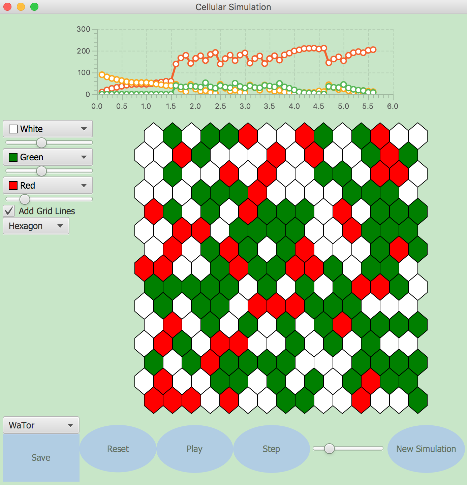

# cellsociety 

#### Project Purpose
- A Java program that animates more than six 2D grid Cellular Automata simulations. This project provides us with a tool to visualize the general phenomenons by asking each individual cell to follow some rules. The simulation is based on various models that consists of a regular grid of cells, each in one of a finite number of states (such as on and off). By varying rules and parameters slightly, we can notice the huge difference of the behavior of these individuals as the group.

#### How to Run the program
- Run Main.java

#### Which model do I have
Currently, we have 6 models to visualize:

1. WaTor
2. Spreading Fire
3. Segregation
4. Game of Life
5. Sugarscape
6. SlimeMold

And one can run but not able to visualize: Foraging Ants.

#### How to set parameters
We provide some buttons for you to set some of the parameters but if you want to have advanced settings, you can go looking for the XML file in the doc folder. These XML files are self-explantory. You can also save the current configuration to a XML file.

